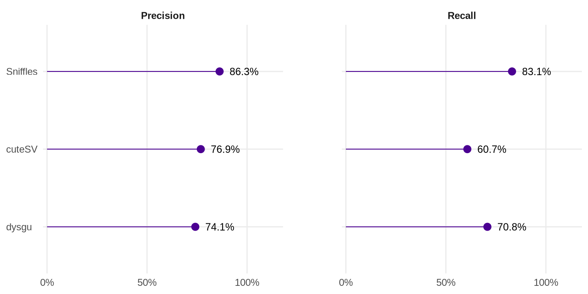
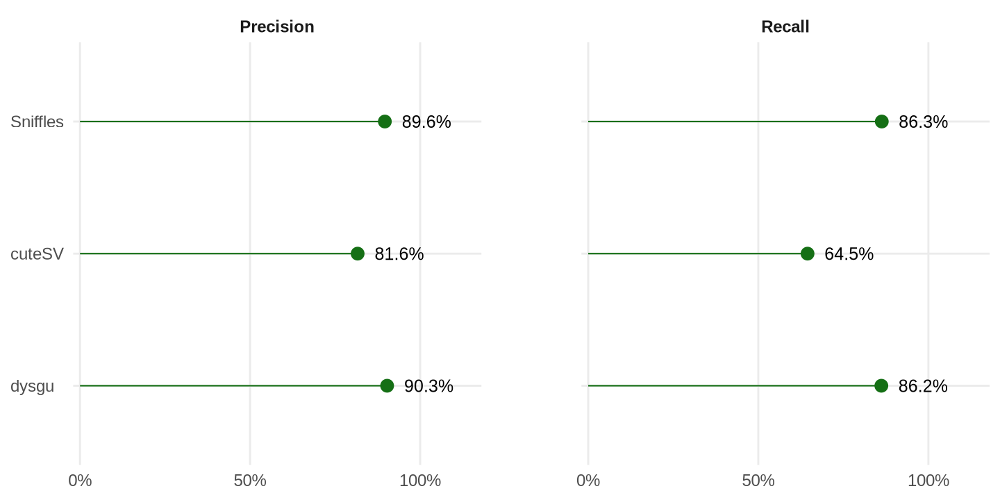
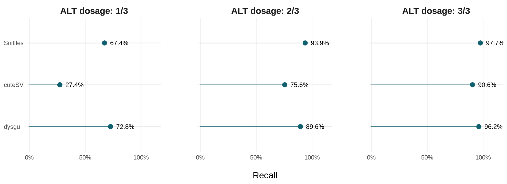

# Cavendish structural-variant benchmark

# Setup
tools and dependancies are managed with [pixi](https://pixi.prefix.dev/latest/installation/), to install all the dependacies download pixi and run
```bash
pixi install
```
# Results

The following is an evaluation of 3 major variant callers (Sniffles, cuteSV, and dysgu) against 4,000 simulated structural
variants in the triploid Cavendish genome. The overall counts and metrics are
available in [metrics.tsv](results/report/metrics.tsv). Precision is the
fraction of reported calls that match a truth variant (TP / (TP + FP)); recall
is the fraction of truth variants detected (TP / (TP + FN)). Higher precision
means fewer false positives, while higher recall means fewer missed variants.

Translocations were excluded when the truth set was simulated, so the 4,000
truth variants comprise only INS, DEL, DUP, and INV. A simulated translocation
would be represented by several linked breakend (BND) records rather than one
VCF record, and callers do not report these junctions in a uniform way.
Sniffles also emits BND records for some events that are not translocations.
Counting BND records individually, or matching them solely by variant type,
could therefore miscount biological events and distort precision and recall.
A translocation benchmark would need to reconstruct each event from its
breakends and compare the connected junctions; that event-level analysis is
outside the scope of this four-type benchmark.

Truvari was run in two ways. The primary analysis requires the call and truth
variant to have the same type. The `dup-to-ins` analysis also allows a
duplication (DUP) in one set to match an insertion (INS) in the other. This
accounts for callers representing the same added sequence differently, and
measures detection when DUP and INS are both treated as sequence gain.

With variant types required to match, Sniffles has the highest overall
precision (86.3%) and recall (83.1%). Allowing DUP–INS matches changes the
results substantially, especially for dysgu: its precision rises from 74.1%
to 90.3%, and recall from 70.8% to 86.2%. Sniffles reaches 89.6% precision
and 86.3% recall under this analysis. dysgu has a slightly higher F1 score
(88.2% versus 87.9% for Sniffles), while Sniffles has marginally higher
overall recall. cuteSV reaches 81.6% precision and 64.5% recall.

**Primary analysis (INS and DUP must match by type):**



**DUP-to-INS analysis (INS and DUP may match):**



Because the matching convention affects the comparison, recall by allele
dosage is also evaluated with `dup-to-ins` matching. Allele dosage here means
the number of haplotypes carrying the variant in this triploid genome: 1/3,
2/3, or 3/3. This comparison uses the same matching convention across callers
and does not require genotype agreement.



All callers have their lowest recall for variants at 1/3 dosage. dysgu detects
72.8% of these variants, compared with 67.4% for Sniffles and 27.4% for
cuteSV. At 2/3 and 3/3 dosage, Sniffles has the highest recall: 93.9% and
97.7%, respectively, versus 89.6% and 96.2% for dysgu.

## take-aways

For this simulated dataset, use Sniffles when it is important to distinguish
duplications from insertions. If both types can be treated as sequence gain,
dysgu is a strong option: it has slightly higher overall precision and F1,
and better recall for variants carried by one of the three haplotypes. Sniffles
has marginally higher overall recall and performs best at the higher dosages.

# Full workflow

### 1) simulate the triploid 🍌 genome

simulate the candidate set of SVs in the form of a VCF file
```bash
pixi run --locked inSVert simulate \
  data/input/config.yaml \
  data/input/cavendish_baxijiao_BXJ1.fa \
  --seed 42 \
  --output data/simulated/requested.vcf
```

insert the SVs into the reference, producing a synthetic genome
```bash
pixi run --locked inSVert insert \
  data/input/cavendish_baxijiao_BXJ1.fa \
  data/simulated/requested.vcf \
  --ploidy 3 \
  --truth-vcf data/simulated/truth.vcf \
  --output data/simulated/simulated.fa
```

This creates `data/simulated/truth.vcf` and
`data/simulated/simulated.fa`.

### 2) generate ONT reads from the genome

The combined FASTA contains three haplotypes, so `10x` over this file gives
approximately 30x aggregate coverage after mapping to the haploid reference.
PBSIM3 targets 87% mean read accuracy and a gamma length distribution with
15 kb mean and 13 kb standard deviation. Run the following from the project
root; the ONT model is included in the Pixi environment.

```bash
(
  set -euo pipefail
  pbsim_dir=$(mktemp -d data/simulated/pbsim3.XXXXXX)

  pixi run --locked pbsim \
    --strategy wgs \
    --method qshmm \
    --qshmm .pixi/envs/default/data/QSHMM-ONT.model \
    --genome data/simulated/simulated.fa \
    --depth 10 \
    --length-mean 15000 \
    --length-sd 13000 \
    --accuracy-mean 0.87 \
    --difference-ratio 39:24:36 \
    --seed 42 \
    --prefix "$pbsim_dir/sd" \
    2> "$pbsim_dir/pbsim.log"

  gzip -t "$pbsim_dir"/sd_*.fq.gz
  cat "$pbsim_dir"/sd_*.fq.gz \
    > data/simulated/simulated_reads.fastq.gz
  rm -r -- "$pbsim_dir"
)
```

### 3) map the simulated reads to the original reference

Since these are simulated ONT reads, map them with minimap2's `map-ont`
preset, coordinate-sort the alignments, and build the BAM index required by the
variant callers:

```bash
pixi run --locked bash -c '
  set -o pipefail
  minimap2 -a -x map-ont -t 10 \
    data/input/cavendish_baxijiao_BXJ1.fa \
    data/simulated/simulated_reads.fastq.gz \
    | samtools sort -@ 8 -m 2G \
        -o data/simulated/simulated.bam -
'

pixi run --locked samtools index -@ 8 \
  data/simulated/simulated.bam
```

### 4) call structural variants
with Sniffles, cuteSV, and dysgu

The simulated reads have 87% mean accuracy, so dysgu uses its noisy ONT
(`nanopore-r9`) preset, which estimates sequence divergence from the BAM.

```bash
mkdir -p data/variant_calls/cutesv_work data/variant_calls/dysgu_work

pixi run --locked sniffles \
  --input data/simulated/simulated.bam \
  --reference data/input/cavendish_baxijiao_BXJ1.fa \
  --threads 10 \
  --vcf data/variant_calls/sniffles.vcf

pixi run --locked cuteSV \
  data/simulated/simulated.bam \
  data/input/cavendish_baxijiao_BXJ1.fa \
  data/variant_calls/cutesv.vcf \
  data/variant_calls/cutesv_work \
  --threads 10 \
  --max_cluster_bias_INS 100 \
  --diff_ratio_merging_INS 0.3 \
  --max_cluster_bias_DEL 100 \
  --diff_ratio_merging_DEL 0.3 &&
  rm -r -- data/variant_calls/cutesv_work

pixi run --locked dysgu call \
  --mode nanopore-r9 \
  --diploid False \
  --procs 10 \
  --overwrite \
  --clean \
  --svs-out data/variant_calls/dysgu.vcf \
  data/input/cavendish_baxijiao_BXJ1.fa \
  data/variant_calls/dysgu_work \
  data/simulated/simulated.bam
```

For the next step we need to create coordinate-sorted, bgzip-compressed VCFs and their tabix indexes:

```bash
pixi run --locked bcftools sort -Oz -o data/variant_calls/sniffles.vcf.gz data/variant_calls/sniffles.vcf
pixi run --locked bcftools index --tbi data/variant_calls/sniffles.vcf.gz
pixi run --locked bcftools sort -Oz -o data/variant_calls/cutesv.vcf.gz data/variant_calls/cutesv.vcf
pixi run --locked bcftools index --tbi data/variant_calls/cutesv.vcf.gz
pixi run --locked bcftools sort -Oz -o data/variant_calls/dysgu.vcf.gz data/variant_calls/dysgu.vcf
pixi run --locked bcftools index --tbi data/variant_calls/dysgu.vcf.gz
```

### 5) Evaluation with truvari


```bash
pixi run --locked python scripts/evaluate_calls.py
```

This prepares sorted, indexed copies in `data/evaluation/`, retaining INS,
DEL, DUP, and INV. It evaluates each caller twice: `primary` requires matching
SVTYPEs; `dup-to-ins` additionally allows DUP and INS to match. Both use
PASS/unfiltered calls, a 50 bp minimum size, and one-to-one matching without
requiring genotype agreement. Sequence comparison is disabled because the
truth insertions are symbolic. BND/TRA counts and other exclusions are recorded
in `data/evaluation/manifest.json`, alongside input checksums and tool versions.

The script runs the following command for each caller, then repeats it with
`--dup-to-ins` and a separate output directory:

```bash
pixi run --locked truvari bench \
  --base data/evaluation/truth.vcf.gz \
  --comp data/evaluation/sniffles.vcf.gz \
  --output results/truvari/sniffles/primary \
  --pick single --passonly \
  --sizemin 50 --sizefilt 50 --sizemax -1 \
  --refdist 500 --pctsize 0.7 --pctseq 0 --pctovl 0 \
  --no-decompose
```

This block illustrates the command already executed by the script; do not run
it again against the same output directory. The script refuses to overwrite
existing evaluation inputs or results; archive them before a fresh run.

For each caller and analysis, retain `summary.json`, `params.json`, `log.txt`,
and the indexed `tp-base.vcf.gz`, `tp-comp.vcf.gz`, `fn.vcf.gz`, and `fp.vcf.gz`.
The script checks VCF counts against the summary and removes only the unused
`candidate.refine.bed` after validation. Overall counts, precision, recall, and F1 are collected in
`results/report/metrics.tsv`.
